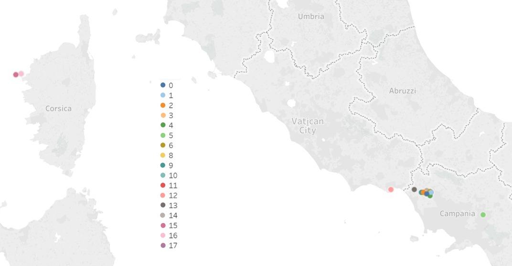

```{r setup, echo = FALSE, results = FALSE, message = FALSE}
  knitr::opts_chunk$set(echo = TRUE)
```

## Spis treœci
1.  [Podsumowanie badañ](#summary_on_begining)
2.  [Wczytanie bibliotek](#libraries)
3.  [PowtarzalnoϾ danych](#repeatability)
4.  [Wczytanie danych](#import)
5.  [Przetwarzanie brakuj¹cych danych](#missing_data)
6.  [Codebook](#codebook)
7.  [Podsumowanie zbioru i podstawowe statystyki](#summary)
    + [Iloœæ atrybutów zbioru](#summary1)
    + [Liczba rekordów](#summary2)
    + [Liczba elektrowni](#summary3)
    + [Niepowtarzalna liczba lokalizacji](#summary4)
    + [Mapa prezentuj¹ca prawdopodobne lokalizacje elektrowni](#summary12)
    + [Liczba producentów elektrowni](#summary5)
    + [Liczba modeli elektrowni](#summary6)
    + [Rozwa¿any przedzia³ czasowy](#summary7)
    + [Przedzia³ godzin w ci¹gu dnia](#summary8)
    + [Podsumowanie wartoœci atrybutów](#summary9)
    + [Pocz¹tek zbioru](#summary11)
8.  [Szczegó³owa analiza wartoœci atrybutów - wykresy rozk³adu wartoœci atrybutów](#detailed_analysis)
    + [Dane techniczne elektrowni](#detailed_analysis1)
    + [Lokalizacja elektrowni](#detailed_analysis2)
    + [Czas pomiaru](#detailed_analysis3)
    + [Dane pogodowe w momencie pomiaru](#detailed_analysis4)
    + [Wartoœci parametru statystycznego Morana I danych pogodowych w momencie pomiaru](#detailed_analysis5)
    + [Parametry s³oñca w momencie pomiaru](#detailed_analysis6)
    + [Wartoœci parametru statystycznego Morana I parametrów s³oñca w momencie pomiaru](#detailed_analysis7)
    + [Parametry pcnm_norm_X](#detailed_analysis8)
    + [WartoϾ wytwarzanej energii](#detailed_analysis9)
9.  [Wykres obrazuj¹cy wytwarzan¹ energiê w czasie w ka¿dej elektrowni](#energy_plot)
10. [Korelacje miêdzy zmiennymi](#correlations)
    + [Tabele korelacji miêdzy atrybutami w zbiorze danych](#correlations1)
    + [Wykresy korelacji atrybutów z energy_kwh_norm](#correlations2)
11. [Zmiana wytwarzanej energii w czasie i przestrzeni](#energy_change)
12. [Tworzenie regresora](#regressor)
    + [Wynik regresji na danych testowych](#analysis1)
    + [Parametry oceny regresji](#analysis2)
    + [Wykresy wa¿noœci atrybutów wykorzystanych w predykcji](#analysis5)


## 1. Podsumowanie badañ <a name="summary_on_begining"></a>

Celem projektu by³o stworzenie regresora, którego zadaniem jest przewidywanie energii wytwarzanej przez 17 elektrowni s³onecznych we W³oszech.

W otrzymanym zbiorze danych mo¿emy znaleŸæ tabelê z wynikami pomiarów czujników umieszczonych przy badanych elektrowniach. Atrybuty mo¿emy podzieliæ na identyfikator, dane techniczne elektrowni, informacje o lokalizacji elektrowni, czas pomiaru, dane pogodowe oraz parametry s³oñca wraz z ich wartoœciami parametru statystycznego Morana I, wektory PCNM oraz wartoœæ wytwarzanej energii. Dla wiêkszej czytelnoœci raportu nazwy atrybutów zosta³y zmienione na angielskie w ramach jednej konwencji nazewniczej.

Czêœæ danych wejœciowych z czujników na wejœciu by³a niepoprawna i nale¿a³o je poprawiæ. Gdy wystêpowa³y w ma³ym przedziale czasu to korekcja polega³a na obliczeniu œredniej z ostatniego dnia przed awari¹ oraz pierwszego po awarii. W przypadku d³u¿szej usterki to nastêpowa³o kopiowane danych z innej elektrowni o podobnych parametrach. Najwiêcej b³êdny pomiarów znaleziono w wierszach gdzie id_location=10 data=1.08-31.12.2012, id_location=3 data=1.01-31.03.2012 oraz w kolumnie sun_radiation_norm. Poprawianie danych nastêpowa³o tylko w zbiorze ucz¹cym.

Najwiêksze korelacje z wartoœci¹ wytwarzanej energii mo¿na by³o zaobserwowaæ dla pomiarów dotycz¹cych s³oñca oraz ich parametrów statystycznych Morana I.

Za dane ucz¹ce przyjêto 2012 rok, natomiast dane testowe pochodz¹ z roku 2013. Generowanie regresora random foreset z trzema drzewami trwa³o 3,5 godziny.

Zdecydowanie najwa¿niejszymi atrybutami do przewidzenia wytwarzania energii okaza³y siê parametry s³oñca: azimuth_norm, sun_radiation_norm, altitude_norm oraz irradiating_norm. Istotny wp³yw na dzia³anie klasyfikatora mia³y równie¿ atrybuty pogody oraz czasu: day_of_year_norm, wind_speed_norm oraz cloud_cover_norm. Sortowanie danych poprawi³o jakoœæ regresji.

Ma³y wp³yw na wynik regresji maj¹ atrybuty zwi¹zane z: lokalizacj¹ elektrowni, wiêkszoœæ parametrów elektrowni oraz wiêkszoœæ parametrów pogody, zarówno wartoœci jak i ich parametry statystyczne Morana I.


## 2. Wczytanie bibliotek <a name="libraries"></a>
Poni¿ej zestawienie wykorzystanych bibiotek. Biblioteka ggplot2 oraz gganimate zosta³y wykorzystane do rysowania wykresów, dplyr do przetwarzania danych, knitr do rysowania tabel, przy pomocy biblioteki caret zosta³ stworzony i przetestowany regresor, nastomiast biblioteki kableExtra oraz formattable umo¿liwi³y utworzenie kolorowego wykresu korelacji.

```{r libraries, error = FALSE, warning = FALSE, results = FALSE, message = FALSE}
  library(ggplot2)
  library(gganimate)
  library(dplyr)
  library(knitr)
  library(caret)
  library(kableExtra)
  library(formattable)
```


## 3. PowtarzalnoϾ danych <a name="repeatability"></a>
Zadaniem poni¿szego kodu jest zapewnienie powtarzalnoœci wyników przy ka¿dym uruchomieniu programu.

```{r repeatability}
  set.seed(3277)
```


## 4. Wczytanie danych <a name="import"></a>
Poni¿szy blok wczytuje dane które bêd¹ przetwarzane.

```{r import1, cache = TRUE, results = FALSE, message = FALSE}
  df <- data.frame(read.csv('elektrownie.csv'))
```

Nastêpnie nastêpuje zmiana nazw kolumn na bardziej czytelne (szczegó³y w code booku).

```{r import2, cache = TRUE, results = FALSE, message = FALSE}
  oldColNames <- c("id", "idsito", "idmodel", "idbrand", "lat", "lon", "ageinmonths", "anno", "day", "ora", "data",
                   "temperatura_ambiente", "irradiamento", "pressure", "windspeed", "humidity", "icon", "dewpoint",
                   "windbearing", "cloudcover", "tempi", "irri", "pressurei", "windspeedi", "humidityi", "dewpointi",
                   "windbearingi", "cloudcoveri", "dist", "altitude", "azimuth", "altitudei", "azimuthi", "pcnm1",
                   "pcnm2", "pcnm3", "pcnm4", "pcnm5", "pcnm6", "pcnm7", "pcnm8", "pcnm9", "pcnm10", "pcnm11",
                   "pcnm12", "pcnm13", "pcnm14", "pcnm15", "irr_pvgis_mod", "irri_pvgis_mod", "kwh")
  newColNames <- c("id", "id_location", "id_model_norm", "id_brand_norm", "latitude_norm", "longitude_norm",
                   "age_in_months_norm", "year", "day_of_year_norm", "hour_of_day_norm", "date_time",
                   "avg_ambient_temperature_norm", "irradiating_norm", "pressure_norm", "wind_speed_norm",
                   "humidity_norm", "icon_norm", "dew_point_norm", "wind_direction_norm", "cloud_cover_norm",
                   "avg_ambient_temperature_i_norm", "irradiating_i_norm", "pressure_i_norm", "wind_speed_i_norm",
                   "humidity_i_norm", "dew_point_i_norm", "wind_direction_i_norm", "cloud_cover_i_norm", "season_norm",
                   "altitude_norm", "azimuth_norm", "altitude_i_norm", "azimuth_i_norm", "pcnm_norm_1", "pcnm_norm_2",
                   "pcnm_norm_3", "pcnm_norm_4", "pcnm_norm_5", "pcnm_norm_6", "pcnm_norm_7", "pcnm_norm_8",
                   "pcnm_norm_9", "pcnm_norm_10", "pcnm_norm_11", "pcnm_norm_12", "pcnm_norm_13", "pcnm_norm_14",
                   "pcnm_norm_15", "sun_radiation_norm", "sun_radiation_i_norm", "energy_kwh_norm")
  colnames(df)[which(colnames(df) %in% oldColNames )] <- newColNames
```

Kolumny id_location, id_brand_norm oraz id_model_norm zosta³y przeskalowane tak aby przechowywa³y wartoœci ca³kowite

```{r import3, cache = TRUE, results = FALSE, message = FALSE}
  df$id_location <- round(df$id_location * 40, 0)
```

Dodane s¹ równie¿ trzy kolejne kolumny - data w formacie posix oraz wspó³rzêdne wyskalowane na potrzeby wykresu animowanego

```{r import4, cache = TRUE, results = FALSE, message = FALSE}
  df$date_posix <- as.POSIXct(gsub("/","-",df$date_time),format="%m-%d-%Y %H:%M",tz="GMT")
  df$longitude_for_animated_plot <- df$longitude_norm
  df$latitude_for_animated_plot <- df$latitude_norm
  df$longitude_for_animated_plot[df$id_location==15 | df$id_location==16] <- df$longitude_for_animated_plot[df$id_location==15 | df$id_location==16] - 0.38
  df$latitude_for_animated_plot[df$id_location==15 | df$id_location==16] <- df$latitude_for_animated_plot[df$id_location==15 | df$id_location==16] - 0.095
  df$longitude_for_animated_plot[df$id_location==0] <- df$longitude_for_animated_plot[df$id_location==0] - 0.05
  df$longitude_for_animated_plot[df$id_location==1] <- df$longitude_for_animated_plot[df$id_location==1] - 0.1
  df$longitude_for_animated_plot[df$id_location==2] <- df$longitude_for_animated_plot[df$id_location==2] - 0.15
  df$longitude_for_animated_plot[df$id_location==3] <- df$longitude_for_animated_plot[df$id_location==3] - 0.2
  df$longitude_for_animated_plot[df$id_location==4] <- df$longitude_for_animated_plot[df$id_location==4] - 0.1
  df$longitude_for_animated_plot[df$id_location==8] <- df$longitude_for_animated_plot[df$id_location==8] + 0.1
  df$longitude_for_animated_plot[df$id_location==9] <- df$longitude_for_animated_plot[df$id_location==9] + 0.2
  df$longitude_for_animated_plot[df$id_location==10] <- df$longitude_for_animated_plot[df$id_location==10] - 0.1
  df$longitude_for_animated_plot[df$id_location==11] <- df$longitude_for_animated_plot[df$id_location==11] - 0.2
  df$longitude_for_animated_plot[df$id_location==13] <- df$longitude_for_animated_plot[df$id_location==13] + 0.1
```

Nastêpnie dane s¹ sortowane wzglêdem daty oraz identyfikatora lokalizacji elektrowni.

```{r import5, cache = TRUE, results = FALSE, message = FALSE}
  df <- arrange(df, id_location, date_posix)
```


## 5. Przetwarzanie brakuj¹cych danych <a name="missing_data"></a>
Z powodu ró¿nych zdarzeñ losowych np. awarii czujników dane wejœciowe s¹ czêœciowo niepoprawne. Aby to naprawiæ skorzystano z nastêpuj¹cych technik:

+ zmiana niepoprawnych danych na wziête z elektrowni, która nie uleg³a awarii, a których parametry ró¿ni¹ siê nieznacznie
+ obliczanie wartoœci œredniej pomiaru bezpoœrednio przed i po awarii i zapisanie w miejsce niepoprawnych danych

Korygowane s¹ dane tylko na potrzeby zbioru ucz¹cego.

Dla elektrowni gdzie id_location = 5, 4, 11, 6 oraz 14 parametr age_in_months_norm = 0 jednak ciê¿ko to naprawiæ gdy¿ brak informacji na temat ich wieku (zero mog³oby oznaczaæ nowo wybudowane elektrownie, jednak z danych wiadomo ¿e ich miminalny wiek to 24 miesi¹ce - wartoœæ zero mog³aby wynikaæ tylko z b³êdu zaokr¹glenia)

Dla elektrowni gdzie id_location = 12, 15 i 16 dane pressure_norm s¹ nietypowe, ale prawdopodobnie ze wzglêdu na po³o¿enie nad morzem i mocne oddalenie od innych dane prawdopodobnie s¹ poprawne. 

Poni¿ej poprawianie wartoœci day_of_year gdzie id_location=2, 4, 5, 6, 10, 11, 13, 14, 15 i 16, dane przepisano z elektrowni id_location=8

```{r missing_data1, cache = TRUE, results = FALSE, message = FALSE}
  for (id_loc in c(2,4,5,6,10,11,13,14,15,16)) {
    df$day_of_year_norm[df$id_location==id_loc] <- df$day_of_year_norm[df$id_location==8]
  }
```

Nastêpnie w podobny sposób poprawiona zosta³a wartoœæ season_norm (w id_location=4, 5, 6, 10, 11, 13, 15 i 16, przepisano z id_location=8)

```{r missing_data2, cache = TRUE, results = FALSE, message = FALSE}
  for (id_loc in c(4,5,6,10,11,13,15,16)) {
    df$season_norm[df$id_location==id_loc] <- df$season_norm[df$id_location==8]
  }
```

Wartoœci sun_radiation_norm poprawione w ró¿nych elektrowniach w ró¿nych przedzia³ach czasowych s¹ poprzez obliczon¹ œredni¹ z przed awarii i po

```{r missing_data3, cache = TRUE, results = FALSE, message = FALSE}
  corr_id_loc <- c(1,2,3,5,6,8,10,11,12,14,15,16,17)
  corr_dates_from <- c("2012-03-01 1:00","2012-07-01 1:00","2012-10-01 1:00","2012-02-01 1:00","2012-07-01 1:00",
                       "2012-12-01 1:00","2012-03-02 1:00","2012-07-01 1:00","2012-10-01 1:00","2012-01-01 1:00",
                       "2012-05-01 1:00","2012-09-01 1:00","2012-12-01 1:00")
  corr_dates_to <- c("2012-03-31 23:00","2012-07-31 23:00","2012-10-31 23:00","2012-03-01 23:00","2012-07-31 23:00",
                     "2012-12-31 23:00","2012-04-01 23:00","2012-07-31 23:00","2012-10-31 23:00","2012-01-31 23:00",
                     "2012-05-31 23:00","2012-09-30 23:00","2012-12-31 23:00")
  corr_get_dates_from <- c("2012-02-28","2012-06-30","2012-09-30","2012-01-31","2012-06-30",
                           "2012-11-30","2012-03-01","2012-06-30","2012-09-30","2013-12-30",
                           "2013-04-30","2013-08-31","2013-11-30")
  corr_get_dates_to <- c("2012-04-01","2012-08-01","2012-11-01","2012-03-02","2012-08-01",
                         "2013-01-01","2012-04-02","2012-08-01","2012-11-01","2012-02-01",
                         "2012-06-01","2012-10-01","2012-01-01")
  for (i in c(1:length(corr_id_loc))) {
    df$sun_radiation_norm[df$id_location==corr_id_loc[i] &
                          as.POSIXct(corr_dates_from[i]) <= df$date_posix &
                          df$date_posix <= as.POSIXct(corr_dates_to[i])] <-
                mean(select(filter(df,id_location==corr_id_loc[i] &
                          (as.character(df$date_posix,format="%Y-%m-%d") == corr_get_dates_from[i] |
                          as.character(df$date_posix,format="%Y-%m-%d") == corr_get_dates_to[i])),sun_radiation_norm)$sun_radiation_norm)
    df$sun_radiation_i_norm[df$id_location==corr_id_loc[i] &
                          as.POSIXct(corr_dates_from[i]) <= df$date_posix &
                          df$date_posix <= as.POSIXct(corr_dates_to[i])] <-
                mean(select(filter(df,id_location==corr_id_loc[i] &
                          (as.character(df$date_posix,format="%Y-%m-%d") == corr_get_dates_from[i] |
                           as.character(df$date_posix,format="%Y-%m-%d") == corr_get_dates_to[i])),sun_radiation_i_norm)$sun_radiation_i_norm)
  }
```

Nastêpnie poprawiane s¹ atrybuty id_location=10 w okresie od 2012-08-01 do 2012-12-31. Wartoœci s¹ pobierane z id_location==9

```{r missing_data4, cache = TRUE, results = FALSE, message = FALSE}
  corr_fields_0.25 <- c("irradiating_norm","avg_ambient_temperature_norm","pressure_norm",
                        "wind_speed_norm","humidity_norm", "dew_point_norm",
                        "wind_direction_norm","cloud_cover_norm", "irradiating_i_norm",
                        "avg_ambient_temperature_i_norm","pressure_i_norm","wind_speed_i_norm",
                        "humidity_i_norm", "dew_point_i_norm","wind_direction_i_norm",
                        "cloud_cover_i_norm","sun_radiation_norm","altitude_norm","azimuth_norm",
                        "sun_radiation_i_norm","altitude_i_norm","azimuth_i_norm", "energy_kwh_norm")
  for (i in c(1:length(corr_fields_0.25))) {
    df[df$id_location==10 &
                       as.POSIXct("2012-08-01 1:00") <= df$date_posix &
                       df$date_posix <= as.POSIXct("2012-12-31 23:00"),corr_fields_0.25[i]] <-
                  df[df$id_location==9 &
                       as.POSIXct("2012-08-01 1:00") <= df$date_posix &
                       df$date_posix <= as.POSIXct("2012-12-31 23:00"),corr_fields_0.25[i]]
  }
```

Na koniec poprawione zostan¹ atrybuty w id_location=3, poprzez przepisane z id_location=2

```{r missing_data5, cache = TRUE, results = FALSE, message = FALSE}
  corr_fields_0.25_2 <- c("irradiating_norm","avg_ambient_temperature_norm", "irradiating_i_norm",
                          "avg_ambient_temperature_i_norm")
  for (i in c(1:length(corr_fields_0.25_2))) {
      df[df$id_location==3 &
                       as.POSIXct("2012-01-01 1:00") <= df$date_posix &
                       df$date_posix <= as.POSIXct("2012-03-31 23:00"),corr_fields_0.25_2[i]] <-
                  df[df$id_location==2 &
                       as.POSIXct("2012-01-01 1:00") <= df$date_posix &
                       df$date_posix <= as.POSIXct("2012-03-31 23:00"),corr_fields_0.25_2[i]]
  }
```


## 6. Codebook <a name="codebook"></a>
Teraz zostan¹ pokazane informacje na temat poszczególnych kolumn w zbiorze.

####Id pomiaru:
+ id - id pomiaru (wartoœæ niepowtarzalna w ca³ym zbiorze)

####Dane techniczne elektrowni:
+ id_brand_norm (orginalna nazwa idbrand) - znormalizowane <0;1> id producenta elektrowni, 6 ró¿nych wartoœci w ca³ym zbiorze, jedna dla jednej elektrowni
+ id_model_norm (orginalna nazwa idmodel) - znormalizowany <0;1> model elektrowni, 11 ró¿nych wartoœci w ca³ym zbiorze, jeden dla jednej elektrowni
+ age_in_months_norm (orginalna nazwa ageinmonths) - znormalizowany <0;1> wiek elektrowni w miesi¹cach, jeden dla jednej elektrowni

####Lokalizacja elektrowni:
+ id_location (orginalna nazwa idsito) - id lokalizacji, 17 ró¿nych wartoœci w ca³ym zbiorze, trzy lokalizacje maj¹ zdublowane wspó³rzêdne latitude_norm i longitude_norm - reprezentuj¹ elektrownie po³o¿one w bliskiej odleg³oœci
+ latitude_norm (orginalna nazwa lat) - latitude (NS) szerokoœæ geograficzna znormalizowana <0;1>, gdzie 0 prawdopodobnie oznacza po³udniowy skrajny punkt w³och, a 1 prawdopodobnie oznacza pó³nocny skrajny punkt w³och
+ longitude_norm (orginalna nazwa lon) - longitude (WE) d³ugoœæ geograficzna znormalizowana <0;1>, gdzie 0 prawdopodobnie oznacza zachodni skrajny punkt w³och, a 1 prawdopodobnie oznacza wschodni skrajny punkt w³och
+ latitude_for_animated_plot i longitude_for_animated_plot - wartoœci latitude_norm i longitude_norm wyskalowane tak aby wykres z punktu 11 by³ bardziej czytelny

####Czas pomiaru:
+ year (orginalna nazwa anno) - rok pomiaru
+ day_of_year_norm (orginalna nazwa day) - znormalizowane <0;1> dni w ci¹gu roku
+ hour_of_day_norm (orginalna nazwa ora) - znormalizowana <0;1> godzina w ci¹gu dnia
+ season_norm (orginalna nazwa dist) - znormalizowana <0;1> pora w ci¹gu roku (najwiêksza wartoœæ 6. stycznia, najni¿sza wartoœæ 6. czerwca)
+ date_time (orginalna nazwa data) - data i godzina pomiaru w formacie M/D/YYYY HH:mm
+ date_posix - dodana kolumna, zawiera datê i godzinê w formacie Posix

####Dane pogodowe w momencie pomiaru znormalizowane <0;1>:
+ avg_ambient_temperature_norm (orginalna nazwa temperatura_ambiente) - œrednia temperatura otoczenia
+ pressure_norm (orginalna nazwa pressure) - œrednia wartoœæ ciœnienia
+ wind_speed_norm (orginalna nazwa windspeed) - œrednia prêdkoœæ wiatru
+ wind_direction_norm (orginalna nazwa windbearing) - œredni kierunek wiatru
+ humidity_norm (orginalna nazwa humidity) - œrednia wilgotnoœæ
+ dew_point_norm (orginalna nazwa dewpoint) - œrednia temperatura punktu rosy
+ cloud_cover_norm (orginalna nazwa cloudcover) - œrednie zachmurzenie
+ icon_norm (orginalna nazwa icon) - ikona pogody, 7 ró¿nych wartoœci

####Wartoœci parametru statystycznego Morana I danych pogodowych w momencie pomiaru znormalizowane <0;1>:
+ avg_ambient_temperature_i_norm (orginalna nazwa tempi) - wartoϾ parametru statystycznego temperatury
+ pressure_i_norm (orginalna nazwa pressurei) - wartoœæ parametru statystycznego ciœnienia
+ wind_speed_i_norm (orginalna nazwa windspeedi) - wartoœæ parametru statystycznego prêdkoœci wiatru
+ wind_direction_i_norm (orginalna nazwa windbearingi) - wartoϾ parametru statystycznego kierunku wiatru
+ humidity_i_norm (orginalna nazwa humidityi) - wartoœæ parametru statystycznego wilgotnoœci
+ dew_point_i_norm (orginalna nazwa dewpointi) - wartoϾ parametru statystycznego temperatury punktu rosy
+ cloud_cover_i_norm (orginalna nazwa cloudcoveri) - wartoϾ parametru statystycznego zachmurzenia

####Parametry s³oñca w momencie pomiaru znormalizowane <0;1>:
+ azimut_norm (orginalna nazwa azimuth) - œredni azymut geograficzny - k¹t miêdzy pó³noc¹ geograczn¹ a lini¹ s³oñca na horyzoncie
+ altitude_norm (orginalna nazwa altitude) - œrednie wzniesienie s³oñca - k¹t miêdzy lini¹ s³oñca na horyzoncie a lini¹ na s³oñce
+ irradiating_norm (orginalna nazwa irradiamento) - œrednia wartoœæ naœwietlenia
+ sun_radiation_norm (orginalna nazwa irr_pvgis_mod) - œrednie promieniowanie s³oñca

####Wartoœci parametru statystycznego Morana I parametrów s³oñca w momencie pomiaru znormalizowane <0;1>:
+ azimuth_i_norm (orginalna nazwa azimuthi) - wartoϾ parametru statystycznego azymutu geograficznego
+ altitude_i_norm (orginalna nazwa altitudei) - wartoœæ parametru statystycznego wzniesienia s³oñca
+ irradiating_i_norm (orginalna nazwa irri) - wartoœæ parametru statystycznego naœwietlenia
+ sun_radiation_i_norm (orginalna nazwa irri_pvgis_mod) - wartoœæ parametru statystycznego promieniowania s³oñca

####Wartoœci wektorów PCNM:
+ kolumny od pcnm_norm_1 do pcnm_norm_15 (orginalne nazwy pcnm1-pcnm15) - wektory PCNM - opisuj¹ zmienne struktury przestrzennej i jej wp³ywu na zmiennoœæ mierzonych parametrów - s¹ znormalizowane <0;1>, jedna wartoœæ ka¿dego parametru dla pojedyñczej elektrowni

####WartoϾ wytwarzanej energii:
+ energy_kwh_norm (orginalna nazwa kwh) - wielkoϾ wytwarzanej energii [kWh] znormalizowana <0;1>


## 7. Podsumowanie zbioru i podstawowe statystyki <a name="summary"></a>
Poni¿ej zaprezentowane zosta³y informacje na temat danych

+ Iloœæ atrybutów zbioru: <a name="summary1"></a>
```{r summary1, echo=FALSE}
  ncol(df)
```

+ Liczba rekordów: <a name="summary2"></a>
```{r summary2, echo=FALSE}
  nrow(df)
```

+ Liczba elektrowni: <a name="summary3"></a>
(niektóre lokalizacje s¹ zdublowane, co oznacza pare elektrowni w bliskim po³o¿eniu)
```{r summary3, echo=FALSE}
  group_by(df, id_location) %>% summarize(count=n()) %>% nrow()
```

+ Niepowtarzalna liczba lokalizacji: <a name="summary4"></a>
```{r summary4, echo=FALSE}
  group_by(df, latitude_norm, longitude_norm) %>% summarize(count=n()) %>% nrow()
```

+ Mapa lokalizacji elektrowni: <a name="summary12"></a>
obraz przedstawia prawdopodobne lokalizacje elektrowni na mapie W³och zak³adaj¹c ¿e latitude_norm=0 oznacza po³udniowy skrajny punkt w³och, a latitude_norm=1 oznacza pó³nocny skrajny punkt w³och oraz ¿e longitude_norm=0 oznacza zachodni skrajny punkt w³och, a longitude_norm=1 oznacza wschodni skrajny punkt w³och. Punkty oznaczaj¹ lokalizacje elektrowni w kolorze ró¿nym dla ka¿dej wartoœci id_location.

```{r summary12, echo=FALSE, out.width='100%'}

```

+ Liczba producentów elektrowni: <a name="summary5"></a>
```{r summary5, echo=FALSE}
  group_by(df, id_brand_norm) %>% summarize(count=n()) %>% nrow()
```

+ Liczba modeli elektrowni: <a name="summary6"></a>
```{r summary6, echo=FALSE}
  group_by(df, id_model_norm) %>% summarize(count=n()) %>% nrow()
```

+ Rozwa¿any przedzia³ czasowy: <a name="summary7"></a>
```{r summary7, echo=FALSE}
  paste(as.character(min(df$date_posix), format="%Y-%m-%d %H:%M")," - ",as.character(max(df$date_posix), format="%Y-%m-%d %H:%M"))
```

+ Przedzia³ godzin w ci¹gu dnia: <a name="summary8"></a>
```{r summary8, echo=FALSE}
  paste(as.character(min(df$date_posix), format="%H:%M")," - ",as.character(max(df$date_posix), format="%H:%M"))
```

+ Podsumowanie wartoœci atrybutów: <a name="summary9"></a>
```{r summary9, echo=FALSE}
  summaryColNames <- c("id", "id_location", "id_model_norm", "id_brand_norm", "latitude_norm", "longitude_norm",
                   "age_in_months_norm", "year", "day_of_year_norm", "hour_of_day_norm",
                   "avg_ambient_temperature_norm", "irradiating_norm", "pressure_norm", "wind_speed_norm",
                   "humidity_norm", "icon_norm", "dew_point_norm", "wind_direction_norm", "cloud_cover_norm",
                   "avg_ambient_temperature_i_norm", "irradiating_i_norm", "pressure_i_norm", "wind_speed_i_norm",
                   "humidity_i_norm", "dew_point_i_norm", "wind_direction_i_norm", "cloud_cover_i_norm", "season_norm",
                   "altitude_norm", "azimuth_norm", "altitude_i_norm", "azimuth_i_norm", "pcnm_norm_1", "pcnm_norm_2",
                   "pcnm_norm_3", "pcnm_norm_4", "pcnm_norm_5", "pcnm_norm_6", "pcnm_norm_7", "pcnm_norm_8",
                   "pcnm_norm_9", "pcnm_norm_10", "pcnm_norm_11", "pcnm_norm_12", "pcnm_norm_13", "pcnm_norm_14",
                   "pcnm_norm_15", "sun_radiation_norm", "sun_radiation_i_norm", "energy_kwh_norm")
  min = c()
  first_qu. = c()
  median = c()
  mean = c()
  third_qu. = c()
  max = c()
  for(colName in summaryColNames) {
    min <- c(min, min(df[,colName]))
    first_qu. <- c(first_qu., quantile(df[,colName], 0.25))
    median <- c(median, median(df[,colName]))
    mean <- c(mean, mean(df[,colName]))
    third_qu. <- c(third_qu., quantile(df[,colName], 0.75))
    max <- c(max, max(df[,colName]))
  }
  kable(summary <- data.frame(column_name = summaryColNames, min, first_qu., median, mean, third_qu., max))
```

+ Pocz¹tek zbioru: <a name="summary11"></a>

<font size="1">

```{r summary11, echo=FALSE, warning = FALSE}
  kable(df[1:10,])
  kable("")
```

</font>

## 8. Szczegó³owa analiza wartoœci atrybutów - wykresy rozk³adu wartoœci atrybutów <a name="detailed_analysis"></a>
Poni¿ej prezentowane s¹ rozk³ady wartoœci poszczególnych atrybutów zbioru danych.

####Dane techniczne elektrowni: <a name="detailed_analysis1"></a>

```{r detailed_analysis1, echo=FALSE, cache = TRUE, fig.width=4, fig.height=4}
  ggplot(df) + geom_density(aes(x = id_brand_norm)) + theme_light()
  ggplot(df) + geom_density(aes(x = id_model_norm)) + theme_light()
  ggplot(df) + geom_density(aes(x = age_in_months_norm)) + theme_light()
```

####Lokalizacja elektrowni: <a name="detailed_analysis2"></a>

```{r detailed_analysis2, echo=FALSE, cache = TRUE, fig.width=4, fig.height=4}
  ggplot(df) + geom_density(aes(x = id_location)) + theme_light()
  ggplot(df) + geom_density(aes(x = latitude_norm)) + theme_light()
  ggplot(df) + geom_density(aes(x = longitude_norm)) + theme_light()
```

####Czas pomiaru: <a name="detailed_analysis3"></a>

```{r detailed_analysis3, echo=FALSE, cache = TRUE, fig.width=4, fig.height=4}
  ggplot(df) + geom_density(aes(x = day_of_year_norm)) + theme_light()
  ggplot(df) + geom_density(aes(x = hour_of_day_norm)) + theme_light()
  ggplot(df) + geom_density(aes(x = season_norm)) + theme_light()
```

####Dane pogodowe w momencie pomiaru: <a name="detailed_analysis4"></a>

```{r detailed_analysis4, echo=FALSE, cache = TRUE, fig.width=4, fig.height=4}
  ggplot(df) + geom_density(aes(x = avg_ambient_temperature_norm)) + theme_light()
  ggplot(df) + geom_density(aes(x = pressure_norm)) + theme_light()
  ggplot(df) + geom_density(aes(x = wind_speed_norm)) + theme_light()
  ggplot(df) + geom_density(aes(x = humidity_norm)) + theme_light()
  ggplot(df) + geom_density(aes(x = dew_point_norm)) + theme_light()
  ggplot(df) + geom_density(aes(x = wind_direction_norm)) + theme_light()
  ggplot(df) + geom_density(aes(x = cloud_cover_norm)) + theme_light()
  ggplot(df) + geom_density(aes(x = icon_norm)) + theme_light()
```

####Wartoœci parametru statystycznego Morana I danych pogodowych w momencie pomiaru: <a name="detailed_analysis5"></a>

```{r detailed_analysis5, echo=FALSE, cache = TRUE, fig.width=4, fig.height=4}
  ggplot(df) + geom_density(aes(x = avg_ambient_temperature_i_norm)) + theme_light()
  ggplot(df) + geom_density(aes(x = pressure_i_norm)) + theme_light()
  ggplot(df) + geom_density(aes(x = wind_speed_i_norm)) + theme_light()
  ggplot(df) + geom_density(aes(x = humidity_i_norm)) + theme_light()
  ggplot(df) + geom_density(aes(x = dew_point_i_norm)) + theme_light()
  ggplot(df) + geom_density(aes(x = wind_direction_i_norm)) + theme_light()
  ggplot(df) + geom_density(aes(x = cloud_cover_i_norm)) + theme_light()
```

####Parametry s³oñca w momencie pomiaru: <a name="detailed_analysis6"></a>

```{r detailed_analysis6, echo=FALSE, cache = TRUE, fig.width=4, fig.height=4}
  ggplot(df) + geom_density(aes(x = sun_radiation_norm)) + theme_light()
  ggplot(df) + geom_density(aes(x = irradiating_norm)) + theme_light()
  ggplot(df) + geom_density(aes(x = altitude_norm)) + theme_light()
  ggplot(df) + geom_density(aes(x = azimuth_norm)) + theme_light()
```

####Wartoœci parametru statystycznego Morana I parametrów s³oñca w momencie pomiaru: <a name="detailed_analysis7"></a>

```{r detailed_analysis7, echo=FALSE, cache = TRUE, fig.width=4, fig.height=4}
  ggplot(df) + geom_density(aes(x = sun_radiation_i_norm)) + theme_light()
  ggplot(df) + geom_density(aes(x = irradiating_i_norm)) + theme_light()
  ggplot(df) + geom_density(aes(x = altitude_i_norm)) + theme_light()
  ggplot(df) + geom_density(aes(x = azimuth_i_norm)) + theme_light()
```

####Parametry pcnm_norm_X: <a name="detailed_analysis8"></a>

```{r detailed_analysis8, echo=FALSE, cache = TRUE, fig.width=2.5, fig.height=2.5}
  ggplot(df) + geom_density(aes(x = pcnm_norm_1)) + theme_light()
  ggplot(df) + geom_density(aes(x = pcnm_norm_2)) + theme_light()
  ggplot(df) + geom_density(aes(x = pcnm_norm_3)) + theme_light()
  ggplot(df) + geom_density(aes(x = pcnm_norm_4)) + theme_light()
  ggplot(df) + geom_density(aes(x = pcnm_norm_5)) + theme_light()
  ggplot(df) + geom_density(aes(x = pcnm_norm_6)) + theme_light()
  ggplot(df) + geom_density(aes(x = pcnm_norm_7)) + theme_light()
  ggplot(df) + geom_density(aes(x = pcnm_norm_8)) + theme_light()
  ggplot(df) + geom_density(aes(x = pcnm_norm_9)) + theme_light()
  ggplot(df) + geom_density(aes(x = pcnm_norm_10)) + theme_light()
  ggplot(df) + geom_density(aes(x = pcnm_norm_11)) + theme_light()
  ggplot(df) + geom_density(aes(x = pcnm_norm_12)) + theme_light()
  ggplot(df) + geom_density(aes(x = pcnm_norm_13)) + theme_light()
  ggplot(df) + geom_density(aes(x = pcnm_norm_14)) + theme_light()
  ggplot(df) + geom_density(aes(x = pcnm_norm_15)) + theme_light()
```

####WartoϾ wytwarzanej energii: <a name="detailed_analysis9"></a>

```{r detailed_analysis9, echo=FALSE, cache = TRUE, fig.width=4, fig.height=4}
  ggplot(df) + geom_density(aes(x = energy_kwh_norm)) + theme_light()
```


## 9. Wykres obrazuj¹cy wytwarzan¹ energiê w czasie w ka¿dej elektrowni <a name="energy_plot"></a>
W tym rozdziale stworzone zosta³y wykresy prezentuj¹cy wytwarzan¹ energiê ró¿nych elektrowni w czasie. Wytwarzana elektrownia jest sumowana w danym miesi¹cu dla danej elektrowni. Podzia³ na cztery wykresy wynika z ma³ej czytelnoœci.

```{r energy_plot, echo=FALSE, cache = TRUE, fig.width=6, fig.height=6}
  summarized_df <- summarize(group_by(df[0<=df$id_location & df$id_location<=3,],id_location = as.factor(id_location),date = as.POSIXct(paste(as.character(df[0<=df$id_location & df$id_location<=3,]$date_posix,format="%Y-%m"), "-01"), format="%Y-%m -%d")), sum_of_energy_kwh = sum(energy_kwh_norm))
  ggplot(summarized_df, aes(x = date, y = sum_of_energy_kwh, color = id_location)) + geom_line() + theme_light()
  
  summarized_df <- summarize(group_by(df[4<=df$id_location & df$id_location<=8,],id_location = as.factor(id_location),date = as.POSIXct(paste(as.character(df[4<=df$id_location & df$id_location<=8,]$date_posix,format="%Y-%m"), "-01"), format="%Y-%m -%d")), sum_of_energy_kwh = sum(energy_kwh_norm))
  ggplot(summarized_df, aes(x = date, y = sum_of_energy_kwh, color = id_location)) + geom_line() + theme_light()
  
  summarized_df <- summarize(group_by(df[9<=df$id_location & df$id_location<=12,],id_location = as.factor(id_location),date = as.POSIXct(paste(as.character(df[9<=df$id_location & df$id_location<=12,]$date_posix,format="%Y-%m"), "-01"), format="%Y-%m -%d")), sum_of_energy_kwh = sum(energy_kwh_norm))
  ggplot(summarized_df, aes(x = date, y = sum_of_energy_kwh, color = id_location)) + geom_line() + theme_light()
  
  summarized_df <- summarize(group_by(df[13<=df$id_location & df$id_location<=17,],id_location = as.factor(id_location),date = as.POSIXct(paste(as.character(df[13<=df$id_location & df$id_location<=17,]$date_posix,format="%Y-%m"), "-01"), format="%Y-%m -%d")), sum_of_energy_kwh = sum(energy_kwh_norm))
  ggplot(summarized_df, aes(x = date, y = sum_of_energy_kwh, color = id_location)) + geom_line() + theme_light()
```


## 10. Korelacje miêdzy zmiennymi <a name="correlations"></a>

###Tabele korelacji miêdzy atrybutami w zbiorze danych <a name="correlations1"></a>
Poni¿ej przedstawione zosta³y tabele korelacji miêdzy atrybutami w zbiorze danych.
Dla wiêkszej czytelnoœci jedna du¿a tabela korelacji zosta³a podzielona na wiele mnieszych. Kolor niebieski i liczba dodatnia oznacza korelacjê proporcjonaln¹, zero oznacza brak korelacji, liczby ujemne oznaczaj¹ korelacjê odwrotn¹. Do obliczenia wspó³czynnika korelacji u¿yto funkcji cor().
<font size="1">

```{r correlations1, echo=FALSE, warning=FALSE}
  first <- c("id_location", "latitude_norm", "longitude_norm", "id_brand_norm", "id_model_norm", "age_in_months_norm", "day_of_year_norm", "hour_of_day_norm", "season_norm", "energy_kwh_norm")
  second <- c("avg_ambient_temperature_norm", "pressure_norm", "wind_speed_norm", "humidity_norm", "dew_point_norm", "wind_direction_norm", "cloud_cover_norm", "icon_norm", "irradiating_norm", "altitude_norm", "azimuth_norm", "sun_radiation_norm", "energy_kwh_norm")
  third <- c("avg_ambient_temperature_i_norm", "pressure_i_norm", "wind_speed_i_norm", "humidity_i_norm", "dew_point_i_norm", "wind_direction_i_norm", "cloud_cover_i_norm", "irradiating_i_norm", "altitude_i_norm", "azimuth_i_norm", "sun_radiation_i_norm", "energy_kwh_norm")
  fourth <- c("pcnm_norm_1", "pcnm_norm_2", "pcnm_norm_3", "pcnm_norm_4", "pcnm_norm_5", "pcnm_norm_6", "pcnm_norm_7", "pcnm_norm_8", "pcnm_norm_9", "pcnm_norm_10", "pcnm_norm_11", "pcnm_norm_12", "pcnm_norm_13", "pcnm_norm_14", "pcnm_norm_15", "energy_kwh_norm")
  
  #first x first
  corr_table <- cor(df[,first], df[,first])
  rownames <- row.names(corr_table)
  corr_table <- cbind(attribute = rownames, round(data.frame(corr_table), 2))
  corr_table <- mutate(corr_table,
    id_location = color_tile("lightpink", "lightblue")(id_location),
    latitude_norm = color_tile("lightpink", "lightblue")(latitude_norm),
    longitude_norm = color_tile("lightpink", "lightblue")(longitude_norm),
    id_brand_norm = color_tile("lightpink", "lightblue")(id_brand_norm),
    id_model_norm = color_tile("lightpink", "lightblue")(id_model_norm),
    age_in_months_norm = color_tile("lightpink", "lightblue")(age_in_months_norm),
    day_of_year_norm = color_tile("lightpink", "lightblue")(day_of_year_norm),
    hour_of_day_norm = color_tile("lightpink", "lightblue")(hour_of_day_norm),
    season_norm = color_tile("lightpink", "lightblue")(season_norm),
    energy_kwh_norm = color_tile("lightpink", "lightblue")(energy_kwh_norm))
  kable_styling(kable(corr_table, "html", escape = FALSE), "striped", full_width = FALSE)
  
  #second x second
  corr_table <- cor(df[,second], df[,second])
  rownames <- row.names(corr_table)
  corr_table <- cbind(attribute = rownames, round(data.frame(corr_table), 2))
  corr_table <- mutate(corr_table,
    avg_ambient_temperature_norm = color_tile("lightpink", "lightblue")(avg_ambient_temperature_norm),
    pressure_norm = color_tile("lightpink", "lightblue")(pressure_norm),
    wind_speed_norm = color_tile("lightpink", "lightblue")(wind_speed_norm),
    humidity_norm = color_tile("lightpink", "lightblue")(humidity_norm),
    dew_point_norm = color_tile("lightpink", "lightblue")(dew_point_norm),
    wind_direction_norm = color_tile("lightpink", "lightblue")(wind_direction_norm),
    cloud_cover_norm = color_tile("lightpink", "lightblue")(cloud_cover_norm),
    icon_norm = color_tile("lightpink", "lightblue")(icon_norm),
    irradiating_norm = color_tile("lightpink", "lightblue")(irradiating_norm),
    altitude_norm = color_tile("lightpink", "lightblue")(altitude_norm),
    azimuth_norm = color_tile("lightpink", "lightblue")(azimuth_norm),
    sun_radiation_norm = color_tile("lightpink", "lightblue")(sun_radiation_norm),
    energy_kwh_norm = color_tile("lightpink", "lightblue")(energy_kwh_norm))
  kable_styling(kable(corr_table, "html", escape = FALSE), "striped", full_width = FALSE)
  
  #third x third
  corr_table <- cor(df[,third], df[,third])
  rownames <- row.names(corr_table)
  corr_table <- cbind(attribute = rownames, round(data.frame(corr_table), 2))
  corr_table <- mutate(corr_table,
    avg_ambient_temperature_i_norm = color_tile("lightpink", "lightblue")(avg_ambient_temperature_i_norm),
    pressure_i_norm = color_tile("lightpink", "lightblue")(pressure_i_norm),
    wind_speed_i_norm = color_tile("lightpink", "lightblue")(wind_speed_i_norm),
    humidity_i_norm = color_tile("lightpink", "lightblue")(humidity_i_norm),
    dew_point_i_norm = color_tile("lightpink", "lightblue")(dew_point_i_norm),
    wind_direction_i_norm = color_tile("lightpink", "lightblue")(wind_direction_i_norm),
    cloud_cover_i_norm = color_tile("lightpink", "lightblue")(cloud_cover_i_norm),
    irradiating_i_norm = color_tile("lightpink", "lightblue")(irradiating_i_norm),
    altitude_i_norm = color_tile("lightpink", "lightblue")(altitude_i_norm),
    azimuth_i_norm = color_tile("lightpink", "lightblue")(azimuth_i_norm),
    sun_radiation_i_norm = color_tile("lightpink", "lightblue")(sun_radiation_i_norm),
    energy_kwh_norm = color_tile("lightpink", "lightblue")(energy_kwh_norm))
  kable_styling(kable(corr_table, "html", escape = FALSE), "striped", full_width = FALSE)
  
  #fourth x fourth
  corr_table <- cor(df[,fourth], df[,fourth])
  rownames <- row.names(corr_table)
  corr_table <- cbind(attribute = rownames, round(data.frame(corr_table), 2))
  corr_table <- mutate(corr_table,
    pcnm_norm_1 = color_tile("lightpink", "lightblue")(pcnm_norm_1),
    pcnm_norm_2 = color_tile("lightpink", "lightblue")(pcnm_norm_2),
    pcnm_norm_3 = color_tile("lightpink", "lightblue")(pcnm_norm_3),
    pcnm_norm_4 = color_tile("lightpink", "lightblue")(pcnm_norm_4),
    pcnm_norm_5 = color_tile("lightpink", "lightblue")(pcnm_norm_5),
    pcnm_norm_6 = color_tile("lightpink", "lightblue")(pcnm_norm_6),
    pcnm_norm_7 = color_tile("lightpink", "lightblue")(pcnm_norm_7),
    pcnm_norm_8 = color_tile("lightpink", "lightblue")(pcnm_norm_8),
    pcnm_norm_9 = color_tile("lightpink", "lightblue")(pcnm_norm_9),
    pcnm_norm_10 = color_tile("lightpink", "lightblue")(pcnm_norm_10),
    pcnm_norm_11 = color_tile("lightpink", "lightblue")(pcnm_norm_11),
    pcnm_norm_12 = color_tile("lightpink", "lightblue")(pcnm_norm_12),
    pcnm_norm_13 = color_tile("lightpink", "lightblue")(pcnm_norm_13),
    pcnm_norm_14 = color_tile("lightpink", "lightblue")(pcnm_norm_14),
    pcnm_norm_15 = color_tile("lightpink", "lightblue")(pcnm_norm_15),
    energy_kwh_norm = color_tile("lightpink", "lightblue")(energy_kwh_norm))
  kable_styling(kable(corr_table, "html", escape = FALSE), "striped", full_width = FALSE)
  
  #first x second
  corr_table <- cor(df[,first], df[,second])
  rownames <- row.names(corr_table)
  corr_table <- cbind(attribute = rownames, round(data.frame(corr_table), 2))
  corr_table <- mutate(corr_table,
    avg_ambient_temperature_norm = color_tile("lightpink", "lightblue")(avg_ambient_temperature_norm),
    pressure_norm = color_tile("lightpink", "lightblue")(pressure_norm),
    wind_speed_norm = color_tile("lightpink", "lightblue")(wind_speed_norm),
    humidity_norm = color_tile("lightpink", "lightblue")(humidity_norm),
    dew_point_norm = color_tile("lightpink", "lightblue")(dew_point_norm),
    wind_direction_norm = color_tile("lightpink", "lightblue")(wind_direction_norm),
    cloud_cover_norm = color_tile("lightpink", "lightblue")(cloud_cover_norm),
    icon_norm = color_tile("lightpink", "lightblue")(icon_norm),
    irradiating_norm = color_tile("lightpink", "lightblue")(irradiating_norm),
    altitude_norm = color_tile("lightpink", "lightblue")(altitude_norm),
    azimuth_norm = color_tile("lightpink", "lightblue")(azimuth_norm),
    sun_radiation_norm = color_tile("lightpink", "lightblue")(sun_radiation_norm),
    energy_kwh_norm = color_tile("lightpink", "lightblue")(energy_kwh_norm))
  kable_styling(kable(corr_table, "html", escape = FALSE), "striped", full_width = FALSE)
  
  #first x third
  corr_table <- cor(df[,first], df[,third])
  rownames <- row.names(corr_table)
  corr_table <- cbind(attribute = rownames, round(data.frame(corr_table), 2))
  corr_table <- mutate(corr_table,
    avg_ambient_temperature_i_norm = color_tile("lightpink", "lightblue")(avg_ambient_temperature_i_norm),
    pressure_i_norm = color_tile("lightpink", "lightblue")(pressure_i_norm),
    wind_speed_i_norm = color_tile("lightpink", "lightblue")(wind_speed_i_norm),
    humidity_i_norm = color_tile("lightpink", "lightblue")(humidity_i_norm),
    dew_point_i_norm = color_tile("lightpink", "lightblue")(dew_point_i_norm),
    wind_direction_i_norm = color_tile("lightpink", "lightblue")(wind_direction_i_norm),
    cloud_cover_i_norm = color_tile("lightpink", "lightblue")(cloud_cover_i_norm),
    irradiating_i_norm = color_tile("lightpink", "lightblue")(irradiating_i_norm),
    altitude_i_norm = color_tile("lightpink", "lightblue")(altitude_i_norm),
    azimuth_i_norm = color_tile("lightpink", "lightblue")(azimuth_i_norm),
    sun_radiation_i_norm = color_tile("lightpink", "lightblue")(sun_radiation_i_norm),
    energy_kwh_norm = color_tile("lightpink", "lightblue")(energy_kwh_norm))
  kable_styling(kable(corr_table, "html", escape = FALSE), "striped", full_width = FALSE)
  
  #first x fourth
  corr_table <- cor(df[,first], df[,fourth])
  rownames <- row.names(corr_table)
  corr_table <- cbind(attribute = rownames, round(data.frame(corr_table), 2))
  corr_table <- mutate(corr_table,
    pcnm_norm_1 = color_tile("lightpink", "lightblue")(pcnm_norm_1),
    pcnm_norm_2 = color_tile("lightpink", "lightblue")(pcnm_norm_2),
    pcnm_norm_3 = color_tile("lightpink", "lightblue")(pcnm_norm_3),
    pcnm_norm_4 = color_tile("lightpink", "lightblue")(pcnm_norm_4),
    pcnm_norm_5 = color_tile("lightpink", "lightblue")(pcnm_norm_5),
    pcnm_norm_6 = color_tile("lightpink", "lightblue")(pcnm_norm_6),
    pcnm_norm_7 = color_tile("lightpink", "lightblue")(pcnm_norm_7),
    pcnm_norm_8 = color_tile("lightpink", "lightblue")(pcnm_norm_8),
    pcnm_norm_9 = color_tile("lightpink", "lightblue")(pcnm_norm_9),
    pcnm_norm_10 = color_tile("lightpink", "lightblue")(pcnm_norm_10),
    pcnm_norm_11 = color_tile("lightpink", "lightblue")(pcnm_norm_11),
    pcnm_norm_12 = color_tile("lightpink", "lightblue")(pcnm_norm_12),
    pcnm_norm_13 = color_tile("lightpink", "lightblue")(pcnm_norm_13),
    pcnm_norm_14 = color_tile("lightpink", "lightblue")(pcnm_norm_14),
    pcnm_norm_15 = color_tile("lightpink", "lightblue")(pcnm_norm_15),
    energy_kwh_norm = color_tile("lightpink", "lightblue")(energy_kwh_norm))
  kable_styling(kable(corr_table, "html", escape = FALSE), "striped", full_width = FALSE)
  
  #second x third
  corr_table <- cor(df[,second], df[,third])
  rownames <- row.names(corr_table)
  corr_table <- cbind(attribute = rownames, round(data.frame(corr_table), 2))
  corr_table <- mutate(corr_table,
    avg_ambient_temperature_i_norm = color_tile("lightpink", "lightblue")(avg_ambient_temperature_i_norm),
    pressure_i_norm = color_tile("lightpink", "lightblue")(pressure_i_norm),
    wind_speed_i_norm = color_tile("lightpink", "lightblue")(wind_speed_i_norm),
    humidity_i_norm = color_tile("lightpink", "lightblue")(humidity_i_norm),
    dew_point_i_norm = color_tile("lightpink", "lightblue")(dew_point_i_norm),
    wind_direction_i_norm = color_tile("lightpink", "lightblue")(wind_direction_i_norm),
    cloud_cover_i_norm = color_tile("lightpink", "lightblue")(cloud_cover_i_norm),
    irradiating_i_norm = color_tile("lightpink", "lightblue")(irradiating_i_norm),
    altitude_i_norm = color_tile("lightpink", "lightblue")(altitude_i_norm),
    azimuth_i_norm = color_tile("lightpink", "lightblue")(azimuth_i_norm),
    sun_radiation_i_norm = color_tile("lightpink", "lightblue")(sun_radiation_i_norm),
    energy_kwh_norm = color_tile("lightpink", "lightblue")(energy_kwh_norm))
  kable_styling(kable(corr_table, "html", escape = FALSE), "striped", full_width = FALSE)
  
  #second x fourth
  corr_table <- cor(df[,second], df[,fourth])
  rownames <- row.names(corr_table)
  corr_table <- cbind(attribute = rownames, round(data.frame(corr_table), 2))
  corr_table <- mutate(corr_table,
    pcnm_norm_1 = color_tile("lightpink", "lightblue")(pcnm_norm_1),
    pcnm_norm_2 = color_tile("lightpink", "lightblue")(pcnm_norm_2),
    pcnm_norm_3 = color_tile("lightpink", "lightblue")(pcnm_norm_3),
    pcnm_norm_4 = color_tile("lightpink", "lightblue")(pcnm_norm_4),
    pcnm_norm_5 = color_tile("lightpink", "lightblue")(pcnm_norm_5),
    pcnm_norm_6 = color_tile("lightpink", "lightblue")(pcnm_norm_6),
    pcnm_norm_7 = color_tile("lightpink", "lightblue")(pcnm_norm_7),
    pcnm_norm_8 = color_tile("lightpink", "lightblue")(pcnm_norm_8),
    pcnm_norm_9 = color_tile("lightpink", "lightblue")(pcnm_norm_9),
    pcnm_norm_10 = color_tile("lightpink", "lightblue")(pcnm_norm_10),
    pcnm_norm_11 = color_tile("lightpink", "lightblue")(pcnm_norm_11),
    pcnm_norm_12 = color_tile("lightpink", "lightblue")(pcnm_norm_12),
    pcnm_norm_13 = color_tile("lightpink", "lightblue")(pcnm_norm_13),
    pcnm_norm_14 = color_tile("lightpink", "lightblue")(pcnm_norm_14),
    pcnm_norm_15 = color_tile("lightpink", "lightblue")(pcnm_norm_15),
    energy_kwh_norm = color_tile("lightpink", "lightblue")(energy_kwh_norm))
  kable_styling(kable(corr_table, "html", escape = FALSE), "striped", full_width = FALSE)
  
  #third x fourth
  corr_table <- cor(df[,third], df[,fourth])
  rownames <- row.names(corr_table)
  corr_table <- cbind(attribute = rownames, round(data.frame(corr_table), 2))
  corr_table <- mutate(corr_table,
    pcnm_norm_1 = color_tile("lightpink", "lightblue")(pcnm_norm_1),
    pcnm_norm_2 = color_tile("lightpink", "lightblue")(pcnm_norm_2),
    pcnm_norm_3 = color_tile("lightpink", "lightblue")(pcnm_norm_3),
    pcnm_norm_4 = color_tile("lightpink", "lightblue")(pcnm_norm_4),
    pcnm_norm_5 = color_tile("lightpink", "lightblue")(pcnm_norm_5),
    pcnm_norm_6 = color_tile("lightpink", "lightblue")(pcnm_norm_6),
    pcnm_norm_7 = color_tile("lightpink", "lightblue")(pcnm_norm_7),
    pcnm_norm_8 = color_tile("lightpink", "lightblue")(pcnm_norm_8),
    pcnm_norm_9 = color_tile("lightpink", "lightblue")(pcnm_norm_9),
    pcnm_norm_10 = color_tile("lightpink", "lightblue")(pcnm_norm_10),
    pcnm_norm_11 = color_tile("lightpink", "lightblue")(pcnm_norm_11),
    pcnm_norm_12 = color_tile("lightpink", "lightblue")(pcnm_norm_12),
    pcnm_norm_13 = color_tile("lightpink", "lightblue")(pcnm_norm_13),
    pcnm_norm_14 = color_tile("lightpink", "lightblue")(pcnm_norm_14),
    pcnm_norm_15 = color_tile("lightpink", "lightblue")(pcnm_norm_15),
    energy_kwh_norm = color_tile("lightpink", "lightblue")(energy_kwh_norm))
  kable_styling(kable(corr_table, "html", escape = FALSE), "striped", full_width = FALSE)
```

</font>

###Wykresy korelacji atrybutów z energy_kwh_norm: <a name="correlations2"></a>

Poni¿ej zaprezentowane zosta³y wykresy ilustruj¹ce energy_kwh_norm w zale¿noœci od atrybutów, które s¹ najbardziej skorelowane. Pole energy_kwh_norm jest atrybutem najwa¿niejszym, którego wartoœæ bêdziemy próbowali przewidzieæ w dalszej czêœci raportu. Najwiêksze korelacje z wartoœci¹ wytwarzanej energii mo¿na by³o zaobserwowaæ dla pomiarów dotycz¹cych s³oñca oraz ich parametrów statystycznych Morana I oraz niektórych pomiarów dotycz¹cych pogody.

```{r correlations4, echo=FALSE, fig.width=4, fig.height=4}
  df_summarized <- summarize(group_by(df, season_norm), mean_of_energy_kwh = mean(energy_kwh_norm))
  ggplot(df_summarized) + geom_line(aes(x = season_norm, y = mean_of_energy_kwh)) + theme_light()
  
  df_summarized <- summarize(group_by(df, avg_ambient_temperature_norm), mean_of_energy_kwh = mean(energy_kwh_norm))
  ggplot(df_summarized) + geom_line(aes(x = avg_ambient_temperature_norm, y = mean_of_energy_kwh)) + theme_light()
  
  df_summarized <- summarize(group_by(df, wind_speed_norm), mean_of_energy_kwh = mean(energy_kwh_norm))
  ggplot(df_summarized) + geom_line(aes(x = wind_speed_norm, y = mean_of_energy_kwh)) + theme_light()
  
  df_summarized <- summarize(group_by(df, humidity_norm), mean_of_energy_kwh = mean(energy_kwh_norm))
  ggplot(df_summarized) + geom_line(aes(x = humidity_norm, y = mean_of_energy_kwh)) + theme_light()
  
  df_summarized <- summarize(group_by(df, wind_direction_norm), mean_of_energy_kwh = mean(energy_kwh_norm))
  ggplot(df_summarized) + geom_line(aes(x = wind_direction_norm, y = mean_of_energy_kwh)) + theme_light()
  
  df_summarized <- summarize(group_by(df, cloud_cover_norm), mean_of_energy_kwh = mean(energy_kwh_norm))
  ggplot(df_summarized) + geom_line(aes(x = cloud_cover_norm, y = mean_of_energy_kwh)) + theme_light()
  
  df_summarized <- summarize(group_by(df, avg_ambient_temperature_i_norm), mean_of_energy_kwh = mean(energy_kwh_norm))
  ggplot(df_summarized) + geom_line(aes(x = avg_ambient_temperature_i_norm, y = mean_of_energy_kwh)) + theme_light()
  
  df_summarized <- summarize(group_by(df, humidity_i_norm), mean_of_energy_kwh = mean(energy_kwh_norm))
  ggplot(df_summarized) + geom_line(aes(x = humidity_i_norm, y = mean_of_energy_kwh)) + theme_light()
  
  df_summarized <- summarize(group_by(df, wind_direction_i_norm), mean_of_energy_kwh = mean(energy_kwh_norm))
  ggplot(df_summarized) + geom_line(aes(x = wind_direction_i_norm, y = mean_of_energy_kwh)) + theme_light()
  
  df_summarized <- summarize(group_by(df, sun_radiation_norm), mean_of_energy_kwh = mean(energy_kwh_norm))
  ggplot(df_summarized) + geom_line(aes(x = sun_radiation_norm, y = mean_of_energy_kwh)) + theme_light()
  
  df_summarized <- summarize(group_by(df, irradiating_norm), mean_of_energy_kwh = mean(energy_kwh_norm))
  ggplot(df_summarized) + geom_line(aes(x = irradiating_norm, y = mean_of_energy_kwh)) + theme_light()
  
  df_summarized <- summarize(group_by(df, altitude_norm), mean_of_energy_kwh = mean(energy_kwh_norm))
  ggplot(df_summarized) + geom_line(aes(x = altitude_norm, y = mean_of_energy_kwh)) + theme_light()
  
  df_summarized <- summarize(group_by(df, azimuth_norm), mean_of_energy_kwh = mean(energy_kwh_norm))
  ggplot(df_summarized) + geom_line(aes(x = azimuth_norm, y = mean_of_energy_kwh)) + theme_light()
  
  df_summarized <- summarize(group_by(df, sun_radiation_i_norm), mean_of_energy_kwh = mean(energy_kwh_norm))
  ggplot(df_summarized) + geom_line(aes(x = sun_radiation_i_norm, y = mean_of_energy_kwh)) + theme_light()
  
  df_summarized <- summarize(group_by(df, irradiating_i_norm), mean_of_energy_kwh = mean(energy_kwh_norm))
  ggplot(df_summarized) + geom_line(aes(x = irradiating_i_norm, y = mean_of_energy_kwh)) + theme_light()
  
  df_summarized <- summarize(group_by(df, azimuth_i_norm), mean_of_energy_kwh = mean(energy_kwh_norm))
  ggplot(df_summarized) + geom_line(aes(x = azimuth_i_norm, y = mean_of_energy_kwh)) + theme_light()
```


## 11. Zmiana wytwarzanej energii w czasie i przestrzeni <a name="energy_change"></a>
W tym roŸdziale prezentowany jest animowany wykres obrazuj¹cy wytwarzan¹ energiê w czasie i przestrzeni. Ka¿da kolejna klatka przezentuje wytwarzan¹ energiê w danym miesi¹cu, osie x i y odpowiadaj¹ wspó³rzêdnym, u¿yty kolor zale¿y od lokalizacji elektrowni, natomiast wielkoœæ punktów jest zale¿na od sumy wytwarzanej energii w danym miesi¹cu. W razie problemów proszê skorzystaæ z przegl¹darki Google Chrome.

```{r energy_change_plot, echo=FALSE, fig.show='animate', fig.width=8, fig.height=8, cache=FALSE, interval=1, aniopts="controls,loop"}
  summ_df <- summarize(group_by(df, id_location = as.factor(id_location), date = format(df$date_posix, "%Y-%m"), longitude = longitude_for_animated_plot,
                                latitude = latitude_for_animated_plot), sum_of_energy_kwh = sum(energy_kwh_norm))
  p <- ggplot(summ_df, aes(longitude, latitude, size = sum_of_energy_kwh, color = id_location, frame = date)) + geom_point() + theme_light()
  gganimate(p)
```


## 12. Tworzenie regresora oraz analiza modelu regresji <a name="regressor"></a>

W tej sekcji tworzony jest regresor, który ma za zadanie przewidzieæ energiê wytwarzan¹ przez elektrownie s³oneczn¹. 

Jako dane ucz¹ce zosta³y u¿yte rekordy z roku 2012, a jako dane testowe - dane z 2013, pozawala to na lepsze nauczenie regresora dla danych z ca³ego roku, jednoczeœnie zachowuj¹c zasadê ci¹g³oœci danych. W trakcie ca³ego roku atrybuty przyjmuj¹ bardzo zró¿nicowane wartoœci np. w zimie jest ma³o s³oñca wiêc ma³o energii, w lecie odwrotnie. 

Do nauki regresora u¿yty zosta³ algorytm Random Forest. Algorytm ten mimo du¿ej iloœci atrybutów i ogromnej porcji danych uczy siê w akceptowalnym czasie, jednoczeœnie zapewniaj¹c dobr¹ jakoœæ regresji. Jest on równie¿ odporny na szumy i wartoœci odstaj¹ce.

Podczas tworzenia regresora pominiêto nastêpuj¹ce atrybuty:

+ id - gdy¿ jest to identyfikator rekordu nieprzydatny do tworzenia regresora
+ id_location - jego funkcjê spe³niaj¹ latitude_norm oraz longitude_norm
+ year - nieprzydatne ze wzlgêdu na podzia³ zbioru
+ pcnm_norm_X - ze wzglêdu na bardzo niskie skorelowanie - nie maj¹ istotnego wp³ywu na wynik, a ich pominiêcie wp³ywa pozytywnie na szybkoœæ przetwarzania
+ date_time oraz date_posix - s¹ nieznormalizowane, poza tym ich funkcjê pe³ni¹ day_of_year_norm oraz hour_of_day_norm
+ longitude_for_animated_plot oraz latitude_for_animated_plot - zosta³y stworzone tylko na potrzeby wykresu animowanego z rozdzia³u 11

```{r regressor, echo = FALSE, warning = FALSE}
  trainingData <- df[df$year == 2012 ,]
  ctrl <- trainControl(method = "repeatedcv", number = 5, repeats = 10)
  formula <- energy_kwh_norm ~ latitude_norm + longitude_norm + 
            id_brand_norm + id_model_norm + age_in_months_norm + 
            season_norm + day_of_year_norm + hour_of_day_norm + 
            avg_ambient_temperature_norm + pressure_norm + wind_speed_norm + humidity_norm + dew_point_norm + wind_direction_norm + cloud_cover_norm + icon_norm + 
            avg_ambient_temperature_i_norm + pressure_i_norm + wind_speed_i_norm + humidity_i_norm + dew_point_i_norm + wind_direction_i_norm + cloud_cover_i_norm + 
            irradiating_norm + altitude_norm + azimuth_norm + sun_radiation_norm + 
            irradiating_i_norm + altitude_i_norm + azimuth_i_norm + sun_radiation_i_norm
  regressor <- train(formula, data = trainingData, method = 'rf', trControl = ctrl, ntree = 3, importance = TRUE)
```

####Wynik regresji na danych testowych <a name="analysis1"></a>

Poni¿ej prezentowany jest wykres na którym mo¿emy zobaczyæ ró¿nice w wielkoœciach faktycznie wytwarzanej energii oraz przewidzianej przez regresor.

```{r analysis1, echo = FALSE, fig.width=8, fig.height=8, warning = FALSE}
  testData <- df[df$year == 2013,]
  result <- predict(regressor,newdata = testData)
  
  result_for_plot <- data.frame(date_posix=c(df[df$year==2013,]$date_posix, df[df$year==2013,]$date_posix),
                                energy_kwh_norm=c(result, df[df$year==2013,]$energy_kwh_norm),
                                type=c("prediction", "orginal"))
  result_for_plot <- summarize(
              group_by(result_for_plot, date = as.POSIXct(as.character(result_for_plot$date_posix, format="%Y-%m-%d"), format="%Y-%m-%d"), type),
              sum_of_energy_kwh = sum(energy_kwh_norm))
  ggplot(result_for_plot) + geom_line(aes(x=date, y=sum_of_energy_kwh, color=type)) + theme_light()
  
  parameters <- postResample(pred=result,obs=df[df$year == 2013,]$energy_kwh_norm)
```

####Parametry oceny regresji <a name="analysis2"></a>

WartoϾ parametru RMSE:

```{r analysis2, echo = FALSE, warning = FALSE}
  parameters[["RMSE"]]
```

WartoϾ parametru Rsquared:

```{r analysis3, echo = FALSE, warning = FALSE}
  parameters[["Rsquared"]]
```

WartoϾ parametru MAE:

```{r analysis4, echo = FALSE, warning = FALSE}
  parameters[["MAE"]]
```

####Wykresy wa¿noœci atrybutów wykorzystanych w predykcji <a name="analysis5"></a>

Poni¿ej zaprezentowane zosta³y wykresy wa¿noœci atrybutów wykorzystanych w predykcji. Najwa¿niejszymi atrybutami s¹ azimuth_norm, sun_radiation_norm oraz day_of_year_norm. Istotny wp³yw na dzia³anie klasyfikatora mia³y równie¿ atrybuty wind_speed_norm, altitude_norm oraz age_in_months_norm.

```{r analysis5, echo = FALSE, fig.width=14, fig.height=6, warning = FALSE}
  atributes_importance <- varImp(regressor)[["importance"]]
  atributes_importance[,"attribute"] <- row.names(atributes_importance)
  atributes_importance <- arrange(atributes_importance, desc(Overall))
  atributes_importance[,"Overall"] <- round(atributes_importance[,"Overall"], 2)
  
  first <- c("latitude_norm", "longitude_norm", "id_brand_norm", "id_model_norm", "age_in_months_norm", "season_norm", "day_of_year_norm", "hour_of_day_norm")
  second <- c("avg_ambient_temperature_norm", "pressure_norm", "wind_speed_norm", "humidity_norm", "dew_point_norm", "wind_direction_norm", "cloud_cover_norm", "icon_norm")
  third <- c("avg_ambient_temperature_i_norm", "pressure_i_norm", "wind_speed_i_norm", "humidity_i_norm", "dew_point_i_norm", "wind_direction_i_norm", "cloud_cover_i_norm")
  fourth <- c("irradiating_norm", "altitude_norm", "azimuth_norm", "sun_radiation_norm", "irradiating_i_norm", "altitude_i_norm", "azimuth_i_norm", "sun_radiation_i_norm")
  
  ggplot(atributes_importance[atributes_importance$attribute %in% first,], aes(attribute)) +
      geom_bar(aes(weight = Overall, color = attribute)) + scale_y_continuous(limits = c(0, 100)) + 
      geom_text(aes(y = Overall, label = paste(Overall,"%"), vjust=-0.2))
  ggplot(atributes_importance[atributes_importance$attribute %in% second,], aes(attribute)) +
      geom_bar(aes(weight = Overall, color = attribute)) + scale_y_continuous(limits = c(0, 100)) +
      geom_text(aes(y = Overall, label = paste(Overall,"%"), vjust=-0.2))
  ggplot(atributes_importance[atributes_importance$attribute %in% third,], aes(attribute)) +
      geom_bar(aes(weight = Overall, color = attribute)) + scale_y_continuous(limits = c(0, 100)) +
      geom_text(aes(y = Overall, label = paste(Overall,"%"), vjust=-0.2))
  ggplot(atributes_importance[atributes_importance$attribute %in% fourth,], aes(attribute)) +
      geom_bar(aes(weight = Overall, color = attribute)) + scale_y_continuous(limits = c(0, 100)) +
      geom_text(aes(y = Overall, label = paste(Overall,"%"), vjust=-0.2))
```